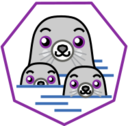

# Podman Manager

Multi-host Podman container management for Unraid and standalone deployment

Podman Manager provides a unified dashboard to monitor and control Podman containers across multiple remote hosts. It connects to each host via SSH and executes Podman commands, exposing the results through a REST API consumed by either the native Unraid plugin or the standalone web application.

## Features

### Core Features
- **Multi-host dashboard** — manage containers across unlimited remote Podman hosts
- **Full container lifecycle** — start, stop, restart, and remove containers from the UI
- **Management method detection** — automatically identifies Quadlet (systemd), Docker Compose, and standalone containers with visual badges
- **Quadlet (systemd) support** — proper systemctl-based lifecycle management for Quadlet containers
- **Compose support** — identifies Docker Compose-managed containers
- **Inline container details** — click anywhere in a container row to expand details (IPs, ports, volumes, networks)
- **Container logs** — view logs directly from the UI with real-time streaming
- **Bulk actions** — checkbox selection with bulk start/stop/restart
- **Sortable columns** — click Container or Host column headers to sort
- **Rootful and rootless Podman** — supports both modes per-host
- **SSH-based** — no agents to install on remote hosts, just SSH key access

### Image Management
- **List images** — view all images across all hosts with size and tag information
- **Pull images** — pull new images from any configured registry
- **Remove images** — delete images with force option for in-use images
- **Prune images** — clean up dangling/unused images across all hosts

### Real-time Updates
- **Event streaming** — WebSocket-based real-time container events
- **Log streaming** — Live log viewer with pause/resume and auto-scroll
- **Snapshot caching** — Reduced SSH polling with configurable TTL (default 3s)

### Security
- **SSH host key verification** — Configurable strictness (strict/accept-new/off)
- **Local authentication** — Optional username/password protection for the web UI
- **Session management** — Secure session-based authentication

### Configuration
- **In-browser config editor** — edit config.yaml with syntax highlighting (ace editor)
- **Hot reload** — configuration changes apply without restart

## Architecture

```
                    ┌─────────────────────────────────────┐
                    │         Go REST API Backend          │
                    │         (localhost:18734)             │
                    ├──────────┬──────────┬────────────────┤
                    │  SSH     │  SSH     │  SSH           │
                    ▼          ▼          ▼                │
              host-alpha    host-beta    host-gamma        │
              (rootful)     (rootful)    (rootless)        │
                    └─────────────────────────────────────┘
                         ▲                    ▲
                         │                    │
                  ┌──────┴──────┐    ┌───────┴───────┐
                  │ Unraid      │    │ React+Vite    │
                  │ Plugin UI   │    │ Web App       │
                  │ (PHP/jQuery)│    │ (standalone)  │
                  └─────────────┘    └───────────────┘
```

## Deployment Options

| Target | Description |
|--------|-------------|
| **Unraid Plugin** | Native Unraid WebGUI tab using PHP/jQuery (Dynamix framework) |
| **Web App** | Modern React+Vite standalone web interface |

Both frontends consume the same Go backend API at `localhost:18734`.

## Installation

### Unraid Plugin

Install from Community Applications (search 'Podman Manager') or manually install via the .plg URL:
`https://raw.githubusercontent.com/brdweb/podman-manager/main/unraid-plugin/podman-manager.plg`

### Standalone

1. Configure your hosts (see Configuration section) and place the file at `webapp/config.yaml`.
2. Start the standalone container:
   ```bash
   cd webapp
   docker compose up --build
   ```
3. Open the UI:
   ```bash
   http://localhost:8080
   ```

## Configuration

The backend uses a YAML configuration file to define the API server settings and the remote Podman hosts.

```yaml
# Podman Manager Configuration
# Copy this to config.yaml and update with your host details.

server:
  # Port for the REST API server
  port: 18734
  # Bind address: 127.0.0.1 for local-only (plugin proxies API through PHP)
  bind: "127.0.0.1"

ssh:
  # Path to the SSH private key (ed25519 recommended)
  key_path: "~/.ssh/id_ed25519"
  # Connection timeout per host
  connect_timeout: "5s"
  # Keepalive interval to prevent SSH drops
  keepalive_interval: "30s"
  # Host key verification: strict, accept-new, or off
  strict_host_key_checking: "accept-new"

# Snapshot cache TTL (reduces SSH polling)
cache_ttl: "3s"

# Enable real-time event streaming via WebSocket
enable_events_stream: true

# Optional local authentication
auth:
  enabled: false
  username: ""
  # Password hash (bcrypt) - generate with: htpasswd -nB username
  password_hash: ""

# Podman hosts to manage
hosts:
  - name: "host-alpha"
    address: "10.0.0.101"
    port: 22
    user: "your-user"
    # rootful = uses 'sudo podman', rootless = uses 'podman' directly
    mode: "rootful"

  - name: "host-beta"
    address: "10.0.0.102"
    port: 22
    user: "your-user"
    mode: "rootful"

  - name: "host-gamma"
    address: "10.0.0.103"
    port: 22
    user: "your-user"
    mode: "rootless"
```

### Configuration Sections

- **server**: Defines the API port and bind address. Use `127.0.0.1` if the frontend is on the same machine (like the Unraid plugin).
- **ssh**: Global SSH settings including the private key path, timeouts, and host key verification mode.
  - `strict_host_key_checking`: 
    - `strict` — Host must be in known_hosts, connection fails if unknown
    - `accept-new` — Automatically add new hosts to known_hosts (default)
    - `off` — Skip host key verification (insecure, not recommended)
- **cache_ttl**: Duration to cache container/stats/system info before re-fetching via SSH.
- **enable_events_stream**: Enable WebSocket-based real-time container events.
- **auth**: Optional local authentication for the web UI.
- **hosts**: A list of remote Podman hosts.
  - **name**: Display name in the UI.
  - **address**: IP or hostname of the remote server.
  - **port**: SSH port (usually 22).
  - **user**: SSH username.
  - **mode**: Either `rootful` (executes commands with `sudo podman`) or `rootless` (executes `podman` directly).

## SSH Setup

Podman Manager connects to remote hosts via SSH. It requires a private key on the backend host and the corresponding public key on each managed host.

### Key Generation

Generate a new SSH key (ED25519 is recommended):
```bash
ssh-keygen -t ed25519 -f /path/to/key -N ""
```

### Key Deployment

Copy the public key to each remote host:
```bash
ssh-copy-id -i /path/to/key.pub user@host
```

For the **Unraid plugin**, keys are typically stored at:
`/boot/config/plugins/podman-manager/`

## Project Structure

```
podman-manager/
├── backend/                 # Go REST API server (shared)
│   ├── cmd/podman-manager/  # Entry point
│   ├── internal/api/        # HTTP handlers + router
│   ├── internal/podman/     # SSH + Podman client + cache + events
│   ├── internal/config/     # YAML config loading
│   └── configs/             # Example configuration
├── unraid-plugin/           # Unraid plugin files
│   ├── podman-manager.plg   # Plugin installer manifest
│   └── src/                 # Plugin source (PHP, JS, events)
└── webapp/                  # React+Vite standalone web UI
    ├── src/api/             # Type-safe API client
    ├── src/components/      # Reusable UI components
    ├── src/pages/           # Dashboard, containers, images, hosts
    ├── Dockerfile           # Multi-stage production build
    └── docker-compose.yaml  # Dev environment
```

## API Reference

| Method | Path | Description |
|--------|------|-------------|
| GET | `/api/health` | Backend health + host connectivity |
| GET | `/api/version` | Backend version |
| GET | `/api/auth/session` | Current session info |
| POST | `/api/auth/login` | Login with credentials |
| POST | `/api/auth/logout` | Logout current session |
| GET | `/api/admin/config` | Get current configuration |
| PUT | `/api/admin/config` | Update configuration |
| GET | `/api/hosts` | List configured hosts with status |
| GET | `/api/hosts/{host}/containers` | List containers on a host |
| GET | `/api/hosts/{host}/containers/{id}` | Inspect container details |
| POST | `/api/hosts/{host}/containers/{id}/start` | Start a container |
| POST | `/api/hosts/{host}/containers/{id}/stop` | Stop a container |
| POST | `/api/hosts/{host}/containers/{id}/restart` | Restart a container |
| DELETE | `/api/hosts/{host}/containers/{id}` | Remove a container |
| GET | `/api/hosts/{host}/containers/{id}/logs` | Container logs (static) |
| GET | `/api/hosts/{host}/containers/{id}/logs/stream` | Container logs (WebSocket stream) |
| GET | `/api/hosts/{host}/images` | List images on a host |
| POST | `/api/hosts/{host}/images/pull` | Pull an image |
| DELETE | `/api/hosts/{host}/images/{id}` | Remove an image |
| POST | `/api/hosts/{host}/images/prune` | Prune unused images |
| GET | `/api/containers` | List all containers across hosts |
| GET | `/api/overview` | Aggregated view of all hosts |
| GET | `/api/events` | WebSocket for real-time container events |

## Web App

### Development

```bash
cd webapp
npm install
npm run dev
```

The dev server starts at `http://localhost:5173` and proxies `/api` requests to the backend at `localhost:18734`.

### Production (Podman)

```bash
podman build -f webapp/Dockerfile -t podman-manager .
podman run --rm -p 8080:80 \
  -v ./webapp/config.yaml:/etc/podman-manager/config.yaml:ro \
  -v ~/.ssh/id_ed25519:/root/.ssh/id_ed25519:ro \
  podman-manager
```

This builds and starts a single container image that runs both the Go backend and nginx-served webapp on port 8080.

## Development

### Prerequisites

- Go 1.26.2+
- Node.js 20+ (for webapp)

### Building

Build the standalone container image:
```bash
podman build -f webapp/Dockerfile -t podman-manager .
```

### Plugin Packaging

Package the Unraid plugin for local testing:
```bash
cd unraid-plugin
make package
```

### Release Building

Generate a versioned release for Community Applications:
```bash
cd unraid-plugin
make release VERSION=$(date +%Y.%m.%d)
```

## Versioning

Podman Manager uses date-based versioning (YYYY.MM.DD format), matching the Unraid plugin convention. The version is:

- Embedded in the backend binary at build time via `-ldflags`
- Displayed in the webapp header
- Shown in the Unraid plugin manifest

## Contributing

Issues and pull requests are welcome. Please ensure any changes follow the project's coding style and include appropriate tests.

## License

GPL-3.0
